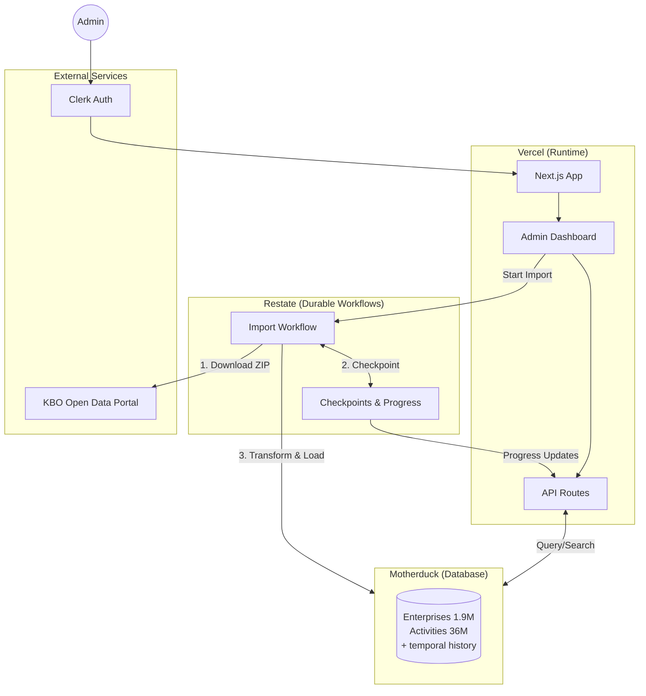

# NewAgeKBO

A modern platform for Belgian KBO (Crossroads Bank for Enterprises) Open Data with temporal tracking, efficient storage, and an admin interface.

## What It Does

NewAgeKBO provides a complete solution for working with Belgian company registry data:

- **Browse & Search** - Find enterprises by name, number, or activity code
- **Temporal Navigation** - View enterprise data at any point in time
- **Automated Imports** - Daily updates from KBO Open Data portal
- **Data Export** - Generate filtered datasets (VAT entities, sector analysis)
- **Multi-Language** - Full support for Dutch, French, and German

## Features

### Admin Dashboard
- Database statistics and health monitoring
- Import job tracking with progress indicators
- Export job management with download links

### Enterprise Browser
- Full-text search across 1.9M Belgian enterprises
- Detailed view with all related data:
  - Denominations (legal names, commercial names)
  - Addresses (registered office, branches)
  - Activities (NACE codes with descriptions)
  - Contacts (phone, email, website)
  - Establishments (physical locations)
- Historical snapshots with temporal navigation

### Data Pipeline
- Durable import workflows (survives failures/restarts)
- Batched processing for large datasets
- Automatic primary name resolution
- 24-month data retention with cleanup

## Tech Stack

| Component | Technology |
|-----------|------------|
| Framework | Next.js |
| Language | TypeScript |
| Database | Motherduck (hosted DuckDB) |
| Auth | Clerk |
| Workflows | Restate SDK |
| UI | TailwindCSS, shadcn/ui |
| Deployment | Vercel |

## Architecture



### How It Works

1. **Authentication** - Admin users sign in via Clerk to access the dashboard
2. **Data Browsing** - API routes query Motherduck for enterprise search, details, and temporal navigation
3. **Import Workflow** - Admin triggers import from UI, Restate orchestrates:
   - Download ZIP from KBO portal (with credentials)
   - Parse CSV files and transform data
   - Batch insert into Motherduck with temporal tracking
   - Checkpoint progress for fault tolerance
4. **Durable Execution** - Restate ensures imports survive failures and can resume from last checkpoint

## Quick Start

### Prerequisites

- Node.js
- Motherduck account ([motherduck.com](https://motherduck.com))
- Clerk account ([clerk.com](https://clerk.com))
- KBO Open Data credentials ([kbopub.economie.fgov.be](https://kbopub.economie.fgov.be))

### Installation

```bash
# Clone repository
git clone https://github.com/yourusername/NewAgeKBO.git
cd NewAgeKBO

# Install dependencies
npm install

# Configure environment
cp .env.example .env.local
# Edit .env.local with your credentials
```

### Environment Variables

```bash
# Motherduck
MOTHERDUCK_TOKEN=your_token
MOTHERDUCK_DATABASE=newagekbo

# Clerk Authentication
CLERK_SECRET_KEY=sk_...
NEXT_PUBLIC_CLERK_PUBLISHABLE_KEY=pk_...

# KBO Portal (for imports)
KBO_USERNAME=your_username
KBO_PASSWORD=your_password

# Restate (local development)
RESTATE_INGRESS_URL=http://localhost:8080
```

### Database Setup

```bash
# Create schema
npx tsx scripts/create-schema.ts

# Verify schema
npx tsx scripts/verify-schema.ts

# Initial import (requires KBO data files)
npx tsx scripts/initial-import.ts ./path/to/KboOpenData_Full
```

### Development

```bash
# Start Next.js dev server
npm run dev

# Start Restate server (separate terminal)
restate-server

# Register workflows with Restate
npx restate deployments register http://localhost:3000/api/restate
```

## Database Schema

### Core Tables

| Table | Records | Description |
|-------|---------|-------------|
| enterprises | 1.9M | Belgian companies with denormalized names |
| establishments | 1.7M | Physical locations per enterprise |
| activities | 36M | Economic activities (NACE codes) |
| denominations | 3.3M | All business names (multi-language) |
| addresses | 2.8M | Physical addresses |
| contacts | 0.7M | Contact information |
| codes | 21.5K | Code descriptions (multi-language) |
| nace_codes | 7.3K | NACE code descriptions |

### Temporal Tracking

All records include temporal metadata:
- `_snapshot_date` - When the data was captured
- `_extract_number` - Sequential identifier from KBO
- `_is_current` - Whether this is the current version
- `_deleted_at_extract` - When the record was deleted

This enables point-in-time queries to see data as it existed at any historical date.

## Project Structure

```
NewAgeKBO/
├── app/                    # Next.js pages and API routes
│   ├── admin/              # Protected admin pages
│   │   ├── browse/         # Enterprise search & detail
│   │   ├── dashboard/      # Statistics overview
│   │   ├── exports/        # Export management
│   │   ├── imports/        # Import job tracking
│   │   └── workflows/      # Restate workflow details
│   └── api/                # REST API endpoints
├── lib/                    # Core business logic
│   ├── motherduck/         # Database queries
│   ├── import/             # Import processing
│   ├── export/             # Export generation
│   ├── restate/            # Workflow definitions
│   └── kbo-client/         # KBO portal client
├── components/             # React components
├── scripts/                # CLI utilities
└── docs/                   # Documentation
```

## CLI Scripts

```bash
# Database management
npx tsx scripts/create-schema.ts         # Create tables
npx tsx scripts/verify-schema.ts         # Verify schema integrity
npx tsx scripts/test-motherduck-connection.ts  # Test connection

# Data operations
npx tsx scripts/initial-import.ts <path>       # Initial full import
npx tsx scripts/apply-daily-update.ts <zip>    # Apply daily update
npx tsx scripts/apply-monthly-snapshot.ts      # Monthly snapshot

# Utilities
npx tsx scripts/list-extracts.ts               # List imports in DB
npx tsx scripts/export-vat-entities.ts         # Export VAT entities
```

## Documentation

- **[CLAUDE.md](CLAUDE.md)** - Development guidance for AI assistants
- **[docs/DATA_ANALYSIS.md](docs/DATA_ANALYSIS.md)** - Data analysis findings
- **[docs/IMPLEMENTATION_GUIDE.md](docs/IMPLEMENTATION_GUIDE.md)** - Technical details
- **[docs/MOTHERDUCK_SETUP.md](docs/MOTHERDUCK_SETUP.md)** - Database setup
- **[specs/KBOCookbook_EN.md](specs/KBOCookbook_EN.md)** - Official KBO specification

## Data Characteristics

Key findings from analyzing KBO Open Data:

| Metric | Value |
|--------|-------|
| Total enterprises | 1.9M |
| Daily update size | ~156 changes |
| Enterprises with address | 60% |
| Enterprises with MAIN activity | 65% |
| Parquet compression ratio | 21x |

- **40% of enterprises have no address** - Natural persons don't have enterprise-level addresses
- **35% have no MAIN activity** - Schema allows NULL for activity
- **Daily updates are tiny** - Only ~0.0008% of dataset changes daily
- **All enterprises have a name** - Denominations table is complete

## License

MIT License - See [LICENSE](LICENSE) for details.

## Acknowledgments

- Belgian Federal Public Service Economy for KBO Open Data
- DuckDB team for the analytics database
- Motherduck for hosted infrastructure
