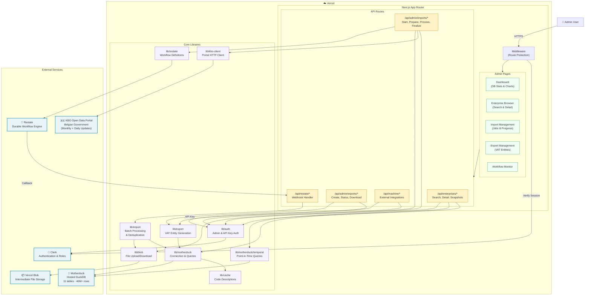
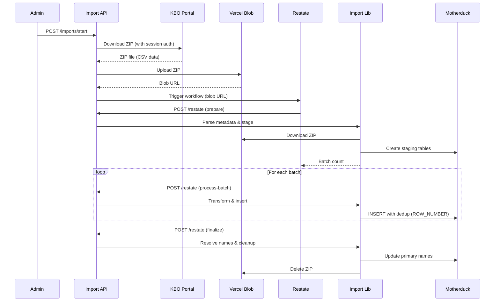
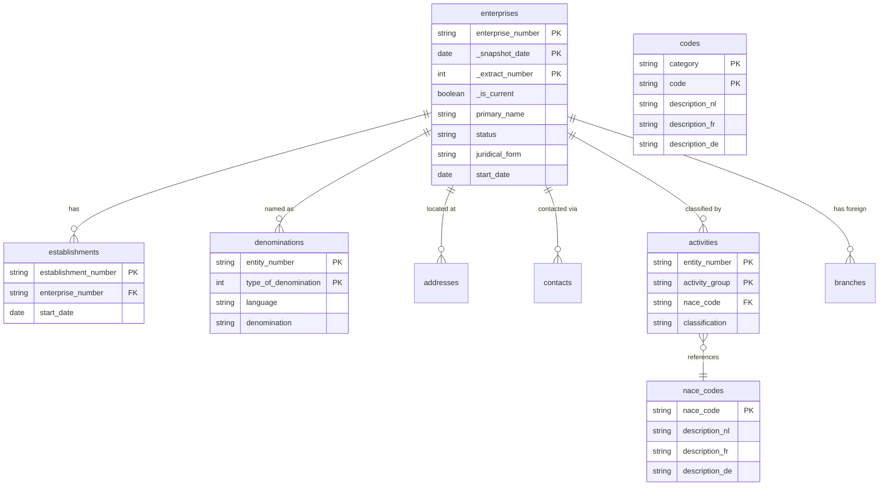

# Architecture Overview

## System Architecture

## Import Data Flow

The import pipeline is the most complex flow, orchestrated by Restate for durability:

## Database Schema

## Key Design Decisions

| Decision | Rationale |
|----------|-----------|
| **Motherduck (hosted DuckDB)** | Analytical workload (aggregations over 46M+ rows); columnar storage ideal for KBO data |
| **Restate durable workflows** | Import jobs can take minutes; durability ensures no data loss on Vercel function timeouts |
| **Vercel Blob for intermediary storage** | KBO ZIPs are too large for Restate payloads; blob acts as shared file system |
| **Temporal versioning** | Composite keys (`_snapshot_date`, `_extract_number`) enable point-in-time enterprise queries |
| **Batch processing with dedup** | KBO CSVs contain duplicates; `ROW_NUMBER` windowing ensures last-row-wins semantics |
| **Multi-language via codes table** | KBO provides NL/FR/DE descriptions; joined at query time for user's selected language |
